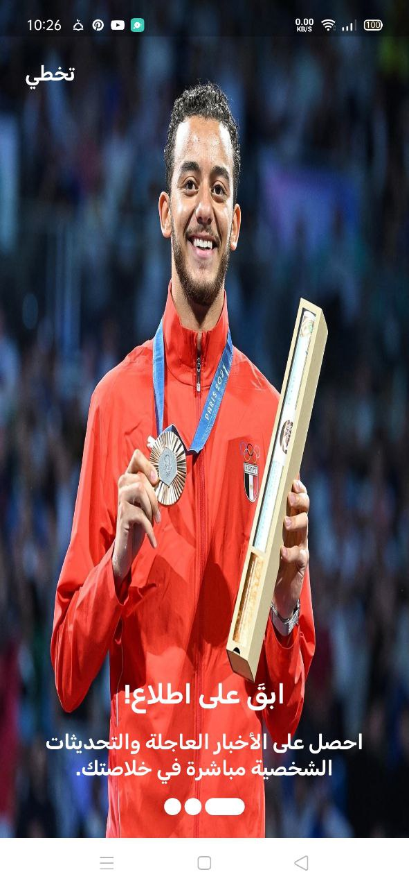

# News App - Al Hekaya
A Flutter-based news application allowing users to browse the latest news, bookmark articles, and explore various news categories. The app supports user authentication using Firebase and features a clean and user-friendly interface.

## Features
- Browse news by categories
- Browse news by search
- Bookmark news articles
- View bookmarked articles
- User authentication (Firebase)
- Real-time news update

## Screenshots

### Splash Page

This is the main splash screen of the app, displayed when the app is launched.

### Home Page

The main page that shows the latest news or primary content of the app. It often includes a list of recent news items with a visually appealing and easy-to-navigate design.

### News Details Page

A page that provides detailed information about a specific news item. It includes the title, author, full description, image, and additional details like the publication date.

### Search Page

The search page allows users to search for news using keywords. It includes a search input field and displays relevant search results based on the query.

### Bookmark Page

A page dedicated to displaying the news items that users have saved as bookmarks. It shows a list of saved articles with the option to view each article's details.

### Setting Page

The settings page where users can adjust app settings. It includes options for logging in, managing the account, sending feedback, and viewing the privacy policy and terms of use.

### Login Page

The login page where users can enter their credentials (such as email and password) to access their accounts in the app.

### Register Page

The registration page that allows users to create a new account. It includes fields for entering basic information such as email, password, and password confirmation.

### Profile Page

 A page that displays the user's personal information. It includes details such as name, email, and profile picture, with options to update personal information.

## Installation
1. Clone the repository:
   ```bash
   git clone https://github.com/YourUsername/Al-Hekaya-NewsApp.git
   ```
2. Navigate to the project directory:
   ```bash
   cd Al-Hekaya-NewsApp
   ```
3. Install dependencies:
   ```bash
   flutter pub get
   ```
4. Run the app:
   ```bash
   flutter run
   ```
   
## Tech Stack
- **Framework**: Flutter
- **State Management**: GetX
- **Backend**: Firebase (Authentication, Firestore)
- 
 ## Inspiration
The app's design and name were inspired by the TV show *الحكاية* by Amr Adib. However, this app is an independent project and is not affiliated with or endorsed by the show or its producers.

## License
[MIT](LICENSE)
